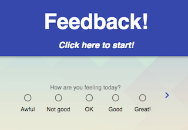
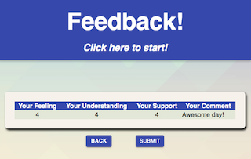
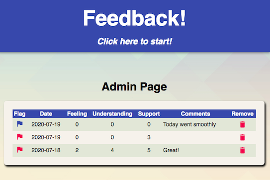

# React/Redux Feedback App

## Description

_Duration: 2 Days_

This is Joel Roske's full stack React/Redux App for anonymous feedback. A user progresses through the pages of a form, their information is stored in redux and submitted to the server. An admin then has options to view, flag, or delete feedback.

## Screen Shot

### Prerequisites

- [Node.js](https://nodejs.org/en/)
- [Postgres](https://www.postgresql.org/download/)

## Installation

1. Create a database named `prime_feedback`.
2. The queries in the `database.sql` file are set up to create all the necessary tables and populate the needed data to allow the application to run correctly. The project is built on [Postgres](https://www.postgresql.org/download/), so you will need to make sure to have that installed. We recommend using Postico to run those queries as that was used to create the queries. 
3. Open up your editor of choice and run an `npm install`
- Make sure you also have `express`, `axios`, `pg`, `react-redux`, `redux-logger`, and `react-router` installed.
4. Run `npm run server` in your first terminal
5. Run `npm run client` in your second terminal
6. The `npm run client` command will open up a new browser tab for you!

## Usage - User

1. On page load, the user will see the first part of a daily feedback form. The user will only be able to advance to the next section of the form (clicking the next arrow) if a selection is made. A comment is not required to advance.
2. The user is always able to go back and change an answer. This resets their answer from before.
3. The user is prompted to review their responses. Changes cannot be made on this page, but the back button is still available.
4. If the user submits, their feedback is posted to the server using an axios POST request.
5. If the submission is successful, the user is brought to a success page.
6. The link to restart the survey is in the headline of each page.

## Usage - Admin

1. `/admin` is where an admin can view feedback results in a table (axios GET request).
2. Date of submission is available here, as well as the option to Flag a comment for review. If flagged, the flag icon will change from blue to red (axios PUT request).
3. Admin also has the option to delete feedback from the server. They are asked to confirm, and feedback is deleted upon confirmation (axios DELETE request).

## Built With

The full stack! React, Redux JSX, Javascript, CSS, Axios, Node, Express, Material UI, and Postgres with SQL.

## Acknowledgement
Thanks to [Prime Digital Academy](www.primeacademy.io) who equipped and helped me to make this application a reality, well as the members of my cohort, Paxos.

## Support
If you have suggestions or issues, please email me at [joel.j.roske@gmail.com](www.google.com)